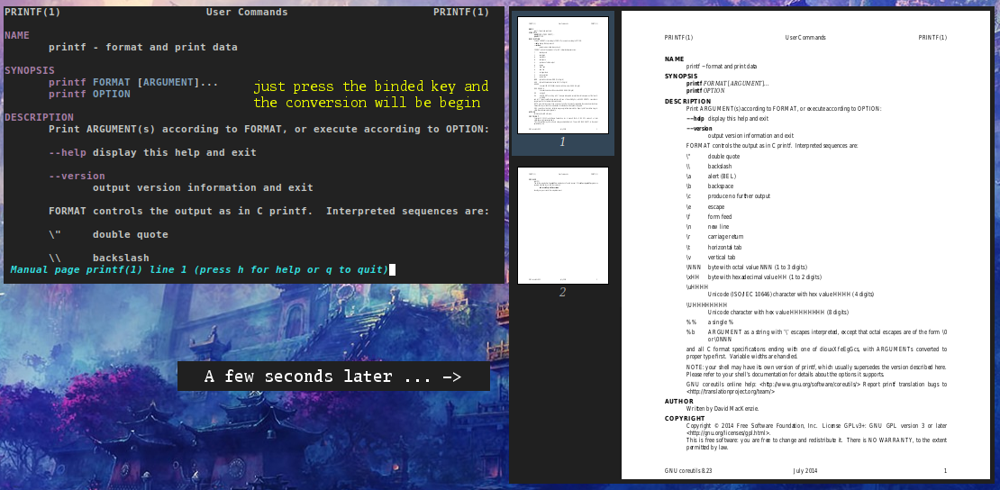

Convert man page while reading it to pdf in urxvt.
No need to quit reading or open another terminal instance/tab.
Bind the desired keyboard shortcut and this extension will do all the heavy lifting for you.



# Installation

Simply place the script in **/usr/lib/urxvt/perl/** for
system-wide availability or in **~/.urxvt/ext/** for user-only availability.
You can also put it in a folder of your choice, but then you have to add this
line to your **.Xdefaults/.Xresources**:

```bash
URxvt.perl-lib: /home/user/your/folder/
# extension to activate
URxvt.perl-ext-common           : man

# keyboard shortcut to trigger the extension
URxvt.keysym.Control-Shift-X    : perl:man:topdf
```

You can convert man pages with your mouse, by default this functionallity is disabled so not to confuse any other extensions, such as url-select.

To enable this functionallity add the following to your **.Xdefaults/.Xresources**:

```bash
URxvt.perl-ext-common           : selection-to-clipboard,man

# 3 is the "right" mouse click button
URxvt.man2pdf.button: 3

# Mark the man page name with
# your left mouse button and right click
# to start the conversion process
```

# Requirements

* ghostscript
* urxvt (rxvt-unicode) compiled with support for perl
